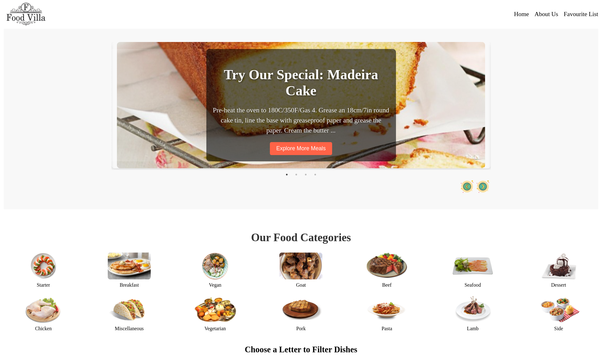
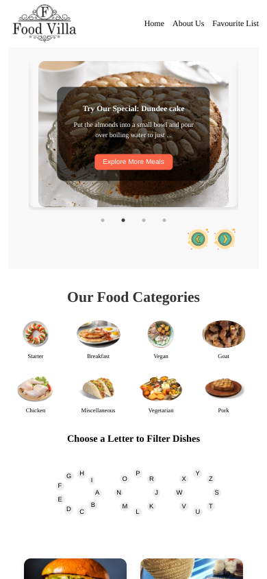

# 🍽️ Food Villa - Recipe Discovery App

[](https://my-food-villa-website.netlify.app/) 
[](https://github.com/RaviPandey2002/Food-Villa/commits/main)

A performant recipe application built with **core React and JavaScript** to demonstrate modern web development fundamentals without relying on UI frameworks.

## 🌟 Live Demo
👉 **Experience it now:** [https://my-food-villa-website.netlify.app/](https://my-food-villa-website.netlify.app/)

## 🧑‍🍳 Key Features

- **Custom API Integration** - Seamless connection with TheMealDB API
- **Framework-Free UI** - Pure CSS with Flexbox/Grid layouts
- **Advanced Search** - Client-side filtering without external libraries
- **Performance Optimized** - Lazy loading + efficient rendering

## 🛠️ Tech Stack

**Core Technologies:**
- React (Create React App)
- JavaScript (ES6+)
- CSS3 (Custom properties, animations)
- HTML5 (Semantic markup)

**Key Implementations:**
- Custom hooks for API calls
- Responsive design with mobile-first approach
- localStorage for persistent favorites
- Error boundaries and loading states

## 🚀 Project Highlights

```js
// Example of custom API handler
const fetchRecipes = async (category) => {
  try {
    const response = await fetch(
      `https://www.themealdb.com/api/json/v1/1/filter.php?c=${category}`
    );
    return await response.json();
  } catch (error) {
    throw new Error('Failed to fetch recipes');
  }
};
```


## 📸 Screenshots
<table>
<thead>
<tr> 
    <td>Desktop View</td>
    <td>Mobile View </td> 
</tr>	

<tbody>
    <tr>
        <td></td>
        <td></td>
    </tr>
</tbody>

</thead>
</table>


<!-- GETTING STARTED -->
## Getting Started

Follow thses steps to run the code on your local host.
To get a local copy up and running follow these simple example steps.

### Prerequisites

This is an example of how to list things you need to use the software and how to install them.
* npm
  ```sh
  npm install npm@latest -g
  ```

### Installation

1. Clone the repo
   ```sh
   gh repo clone https://github.com/RaviPandey2002/Food-Villa.git
   ```
2. Install NPM packages
   ```sh
   npm install
   ```
4. Open the terminal in the root folder and run the command 
   ```sh
   npm run dev
   ```

#### Open in the http://localhost:3000 to open the instance of the app and copy the link in the other tab and see the magic. 
 


<!-- CONTRIBUTING -->
## Contributing
 Any contributions you make are **greatly appreciated**.

If you have a suggestion that would make this better, please fork the repo and create a pull request. You can also simply open an issue with the tag "enhancement".
Don't forget to give the project a star! Thanks again!

1. Fork the Project
2. Create your Feature Branch (`git checkout -b feature/AmazingFeature`)
3. Commit your Changes (`git commit -m 'Add some AmazingFeature'`)
4. Push to the Branch (`git push origin feature/AmazingFeature`)
5. Open a Pull Request

 


